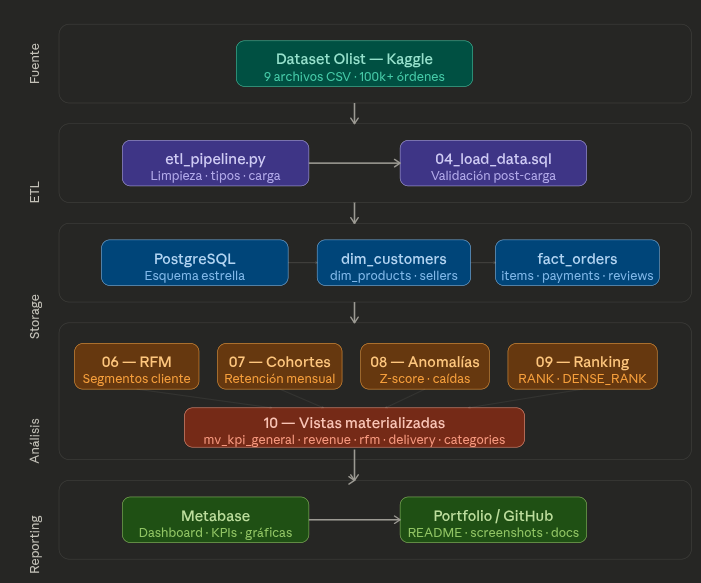
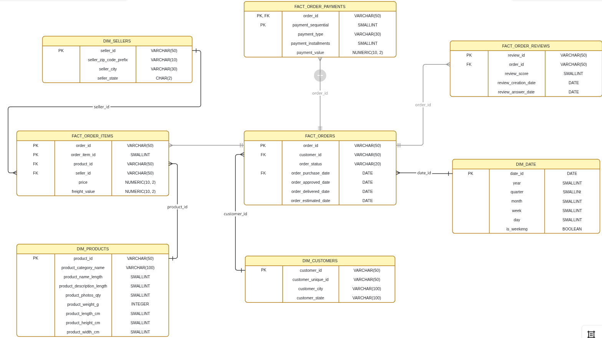

# E-Commerce Analytics - SQL advanced Analysis

> Análisis completo de datos de e-commerce usando SQL avanzado, ETL con Python
> e integración de AI para detección automática de anomalías.

---

## Problema de negocio

Empresa <E-Commerce> no tenía visibilidad sobre qué productos generaban valor real, en qué momentos del mes se encontraban pérdidas, ni sabían el riesgo de abandono de clientes. Este proyeto construye una capa analítica desde cero para contrarestar y proponer cambios en base al análisis.

---

## Objetivos

- Modelar un esquema dimensional sobre datos reales de e-commerce.
- Construir análisis RFM y de cohortes con SQL avanzado.
- Detectar anomalías estadísticas en ventas automáticamente.
- Integrar AI para generar resúmenes en lenguaje natural.

---

## Arquitectura

CSV (Kaggle) -> Python ETL -> PostgreSQL -> SQL Analysis ->  Metabase Dashboard
                                |-> Anomaly detection .> OpenAI/Ollama -> ai_insights_table

---

---

## Stack tecnológico

| Herramienta | Uso |
|---|---|
| PostgreSQL | Motor de Base de Datos |
| Python 3.11 | ETL y conexión a AI |
| DBeaver | IDE SQL |
| Metabase | Visualizacion |
| OpenAI / Ollama | Generación de insights |
| Github | Control de versiones |

---

## Dataset

- **Fuente:** [Brazilian E-Commerce (Olist) - Kaggle](https://www.kaggle.com/dataset/olistbr/brazilian-ecommerce)
- **Volumen:** 100k+ órdenes, 9 tablas relacionadas.
- **Periodo:** 2016-2018

---

## Modelo de datos

**Tablas principales**
- 'fact_orders' - tabla de hechos central
- 'dim_customers' - dimensión de clientes
- 'dim_products' - dimensión de productos
- 'dim_sellers' - dimensión de vendedores

---

## Análisis desarrollados

### 1. Análisis RFM
Segmentación de clientes por Recency, frequency y monetary value usando CTEs encadenadas y window functions.
´´´sql

->

### 2. Análisis de cohortes
### 3. Detección de anomalías
### 4. Ranking de productos por categoría

> Ver carpeta ´/sql/analysis/'para queries completas documentadas.

---

## Performance & optimization

| Query | Sin indice | Con indice | Mejora |
| --- | --- | --- | --- |
| RFM full scan | -> 0.0s | -> 0.0s | -> 0% |
| Cohort analysis | -> 0.0s | -> 0.0s | -> 0% |

Indices creados y justificados en ´sql/ddl/03_create_indexes.sql´

---

## Integración AI

Cuando el pipeline detecta productos con caída de ventas >30% semana a semana.
´python/ai_insights.py' envía los datos a OpenAI/Ollama y guarda el resumen en la tabla ´ai_inisghts.py´.

## Dashboard

---

## Cómo ejecutar este proyecto

## Requisitos
- PostgreSQL 15+
- Python 3.9+

## Setup
´´´bash
# 1. Clonar repositorio
git clone https://github.com/[tu_usuario]/ecommerce-analytics
cd ecommerce-analytics

# 2. Instalar dependencias Python
pip install -r requirements.txt

# 3. Crear bases de datos
psql -U postgres -f sql/ddl/01_create_schema.sql
psql -U postgres -f sql/ddl/02_create_tables.sql
psql -U postgres -f sql/ddl/03_create_indexes.sql

# 4. Descargar dataset de kaggle y colocar CSVs en /data/raw/

# 5. Ejecutar ETL
python python/etl_pipeline.py

# 6. Ejecutar análisis
psql -U postgres -f sql/analysis/05_rfm_analysis.sql
´´´

---

## Lo que aprendí
- 

## Habilidades demostradas

´
´

---

## Contacto

**Davidv3**
www.linkedin.com/in/davidv3 | davidgj2303@gmail.com |