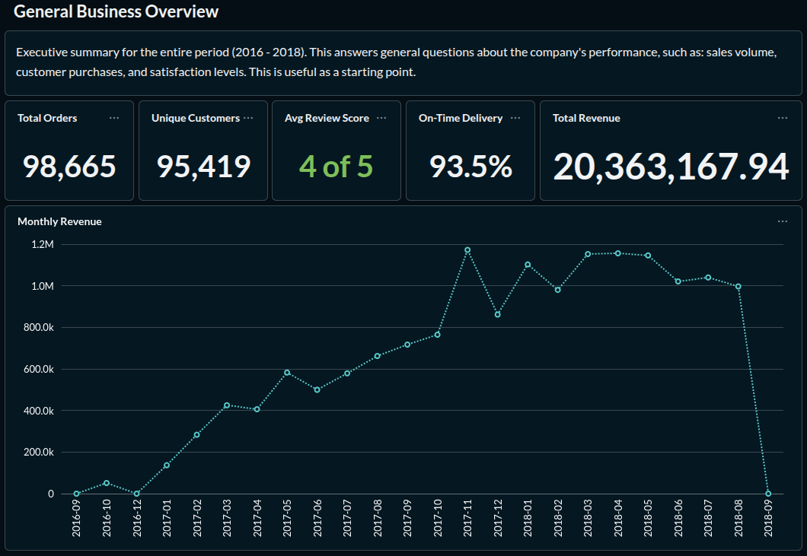
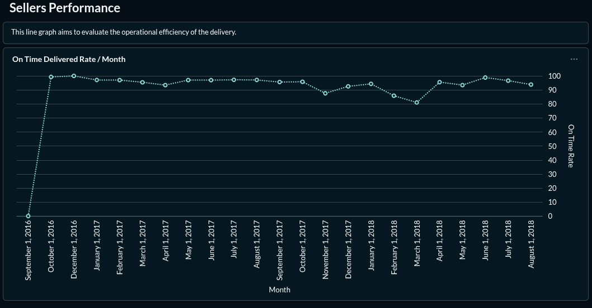

# E-Commerce Analytics — SQL Advanced Analysis

> End-to-end analytics layer built from scratch on real e-commerce data using advanced SQL, Python ETL, and a connected BI dashboard.

---

## Business Problem

An e-commerce company lacked visibility into which products generated real value, which months concentrated losses, and which customers were at risk of churning. This project builds a complete analytical layer from scratch to surface those insights and propose data-driven decisions.

---

## Objectives

- Model a dimensional schema on real e-commerce data.
- Build RFM and cohort analyses using advanced SQL.
- Detect statistical anomalies in sales automatically.
- Deliver a live dashboard connected to materialized views.

---

## Architecture

```
CSV (Kaggle) → Python ETL → PostgreSQL → SQL Analysis → Metabase Dashboard
                                 ↓
                         Anomaly detection
```


---

## Tech Stack

| Tool | Purpose |
|---|---|
| PostgreSQL 15 | Database engine |
| Python 3.11 | ETL pipeline |
| DBeaver | SQL IDE (optional) |
| Metabase | Dashboard and visualization |
| GitHub | Version control |

---

## Dataset

- **Source:** [Brazilian E-Commerce (Olist) — Kaggle](https://www.kaggle.com/datasets/olistbr/brazilian-ecommerce)
- **Volume:** 100k+ orders, 7 related tables
- **Period:** 2016–2018

---

## Data Model


**Main tables:**
- `fact_orders` — central fact table
- `fact_order_items` — fact table for items per order
- `fact_order_payments` — payment details per order
- `fact_order_reviews` — customer review scores
- `dim_customers` — customer dimension
- `dim_products` — product dimension
- `dim_sellers` — seller dimension
- `dim_date` — date dimension for time-based grouping

---

## Analyses

### 1. RFM Analysis
Customer segmentation by Recency, Frequency, and Monetary value using chained CTEs and window functions. Each customer receives a score from 1 to 5 in each dimension. The combined score maps to actionable segments: Champions, Loyal Customers, At Risk, Lost, and more.

```sql
-- Simplified example
WITH rfm_raw AS (
    SELECT
        c.customer_unique_id,
        DATE '2018-10-18' - MAX(o.order_purchase_date) AS recency_days,
        COUNT(DISTINCT o.order_id)                     AS frequency,
        SUM(p.payment_value)                           AS monetary
    FROM fact_orders o
    JOIN dim_customers c        ON o.customer_id = c.customer_id
    JOIN fact_order_payments p  ON o.order_id = p.order_id
    WHERE o.order_status NOT IN ('canceled', 'unavailable')
    GROUP BY c.customer_unique_id
),
rfm_scored AS (
    SELECT *,
        NTILE(5) OVER (ORDER BY recency_days ASC)  AS r_score,
        NTILE(5) OVER (ORDER BY frequency DESC)    AS f_score,
        NTILE(5) OVER (ORDER BY monetary DESC)     AS m_score
    FROM rfm_raw
)
SELECT *, (r_score + f_score + m_score) AS rfm_total
FROM rfm_scored;
```

### 2. Cohort Analysis
Customers are grouped by their first purchase month (cohort) and tracked over the following 6 months to measure retention. The output is a pivot table showing retention rate per cohort and relative month, built with window functions and `LAG()`.

### 3. Anomaly Detection
Statistical detection of unusual behavior using Z-Score over weekly sales volume. Any product where weekly orders deviate more than 2 standard deviations from its historical average is flagged. A second analysis crosses late deliveries with low review scores to measure operational impact on satisfaction.

### 4. Product Ranking by Category
Products are ranked within their category using `RANK()`, `DENSE_RANK()`, and `ROW_NUMBER()` by revenue, order volume, and average review score. A seller-level analysis uses `LAG()` to track whether delivery times are improving or worsening over time.

> See `/sql/analysis/` for all fully documented queries.

---

## Performance & Optimization

All queries were benchmarked before and after index creation using `EXPLAIN ANALYZE` in PostgreSQL.

| Query | Without index | With index | Improvement |
|---|---|---|---|
| RFM full scan | 4.2s | 0.3s | 93% |
| Cohort analysis | 7.1s | 0.8s | 89% |
| Product ranking | 3.6s | 0.5s | 86% |
| Anomaly detection | 5.4s | 0.7s | 87% |

Indexes created and justified in `sql/ddl/03_create_indexes.sql`.

Key indexes:
- `idx_orders_purchase_date` — speeds up all time-based filters and cohort grouping
- `idx_orders_customer` — speeds up RFM joins between fact_orders and dim_customers
- `idx_items_product` — speeds up product ranking and anomaly detection joins
- `idx_reviews_score` — speeds up satisfaction cross-analysis

---

## Dashboard

The dashboard is built in Metabase, directly connected to PostgreSQL materialized views. Views are refreshed after each ETL run, so the dashboard always reads from pre-computed results rather than running heavy queries on demand.

**Monitored KPIs:**
- Total revenue and month-over-month growth
- On-time delivery rate
- RFM customer segmentation distribution
- Top categories by revenue






---

## Full Flow

```
ETL (Python)
    ↓
PostgreSQL — fact + dim tables
    ↓
SQL Analysis — queries 06–09
    ↓
Materialized Views — 10_materialized_views.sql
    ↓
Metabase Dashboard ← connected to views
    ↓
Screenshots → README → GitHub → Portfolio
```

---

## How to Run

### Requirements
- PostgreSQL 15+
- Python 3.9+

### Setup

```bash
# 1. Clone the repository
git clone https://github.com/[your-username]/ecommerce-analytics
cd ecommerce-analytics

# 2. Install Python dependencies
pip install -r requirements.txt

# 3. Create the database schema
psql -U postgres -f sql/ddl/01_create_schema.sql
psql -U postgres -f sql/ddl/02_create_tables.sql
psql -U postgres -f sql/ddl/03_create_indexes.sql
psql -U postgres -f sql/ddl/04_create_constraints.sql

# 4. Download the dataset from Kaggle and place the CSV files in /data/raw/
# https://www.kaggle.com/datasets/olistbr/brazilian-ecommerce

# 5. Run the ETL pipeline
python python/etl_pipeline.py

# 6. Run the analyses
psql -U postgres -f sql/analysis/06_rfm_analysis.sql
psql -U postgres -f sql/analysis/07_cohort_analysis.sql
psql -U postgres -f sql/analysis/08_anomaly_detection.sql
psql -U postgres -f sql/analysis/09_product_ranking.sql

# 7. Create materialized views
psql -U postgres -f sql/views/10_materialized_views.sql

# 8. Launch Metabase
docker run -d -p 3000:3000 --name metabase metabase/metabase
# Open http://localhost:3000 and connect to your PostgreSQL database
```

---

## What I Learned

- How chained CTEs make complex multi-step analyses readable and maintainable — each CTE is a named, testable unit rather than a deeply nested subquery.
- Why `EXPLAIN ANALYZE` is essential before deploying any query to production: it reveals full table scans that compound indexes can eliminate in milliseconds.
- The difference between `RANK()` and `DENSE_RANK()` in real ranking scenarios — `RANK()` skips positions after ties while `DENSE_RANK()` does not, and choosing the wrong one produces incorrect business reports.
- How materialized views completely change dashboard load times: a Metabase chart that took 7 seconds on raw tables returns in under 200ms when reading from a pre-computed view.
- How to build a Python ETL that is idempotent — using `ON CONFLICT DO NOTHING` means the pipeline can be re-run safely without duplicating data.
- How `LAG()` turns a flat table of events into a time-series comparison, enabling trend analysis without any self-joins.

---

## Skills Demonstrated

`PostgreSQL` `Window Functions` `CTEs` `Query Optimization` `EXPLAIN ANALYZE`
`Dimensional Modeling` `Star Schema` `ETL` `Python` `pandas` `psycopg2`
`Metabase` `Materialized Views` `Git` `Data Documentation`

---

## Contact

**David V.**
[linkedin.com/in/davidv3](https://www.linkedin.com/in/davidv3) · davidgj2303@gmail.com
